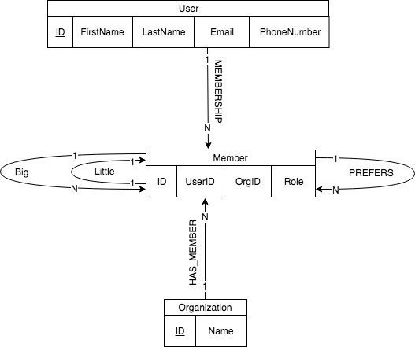

# Preliminary Database Demonstration

### Edward Bachoura, Brian Joerger, Haley Fletcher

##### November 27th, 2018


#### Big Little ERD




##### Example Queries

1. Access the email of a specific member.

   ```
   Match (u:User)-[:MEMBERSHIP]->(Member {ID: 17})
   Return u.Email
   ```


2. Access a specific Users related Member entities.

   ```
   Match (u:User {ID: 17})-[:MEMBERSHIP]->(m:Member)
   Return m
   ```

3. Access a Member's most preffered Member.

   ```
   Match (Member {ID: 17})-[p:PREFERS {rank: 1}]->(m:Member)
   Return m
   ```

4. Access all the matches for a specific organization.

   ```
   Match (Organization {ID: 0})-[:HAS_MEMBER]->(Member)-[b:BIG]->()
   Return b
   ```

5. Access all of the organizations that a user is involved in.

   ```
   Match (u:User)-[:MEMBERSHIP]->(Member)<-[b:HAS_MEMBER]-(Organization {ID: 0})
   Return u
   ```

   ​