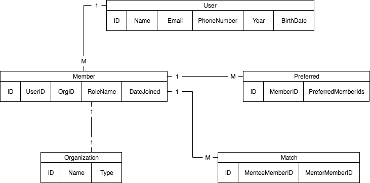

# Detailed Database Design Document

## 2.1 Project Description

The database produced by this project will support a future senior thesis project. The goal of this project is to create a website which helps group administrators, primarily in college environments, pair up mentors and mentees by taking into account their preferred pairings. These relationships serve to provide mentees with a connection to an experienced member, from which they can receive valuable guidance. This database would store key information on organizations, as well as each of their members. Thus, members will have an easy avenue to find information about their organization, as well as provide organization administrators with an easy way to keep track of their members' information. Since the problem of pairing group members is very algorithmically complex in nature, we have decided to use a genetic algorithm to quickly find a solution without spending too much time testing the viability of every set of matches. We will be using MySQL to store the organizations and all of their members, as well as the relationships between them. We chose MySQL because our problem is very suitable for a relational database and MySQL is among the most popular of such databases.

## 2.2 Data Dictionary

**User** - people, primarily college students, that will interact with the database

| Attribute    | Description | Type |
| --------------- | ---- | ---- |
| ID | Primary key | int |
| Name        | Name of the user |   string   |
| Email       | Email of the user | string |
| PhoneNumber | Phone number of the user | string |
| Year        | Graduation year | int |
| BirthDate   | Birthday of the user | date |

**Organization** - group of members, primarily college organizations (sororities, fraternities, service orgs, etc.), with a collective name and societal type

| Attribute | Description              | Type   |
| :-------- | ------------------------ | ------ |
| ID        | Primary key              | int    |
| Name      | Name of the organization | string |
| Type      | Organization type        | string |

**Member** - membership of an organization for a user

| Attribute  | Description                                                  | Type   |
| ---------- | ------------------------------------------------------------ | ------ |
| ID         | Primary key                                                  | int    |
| UserID     | Foreign key relating to this member's user entity            | int    |
| OrgID      | Foreign key relating to the organization which this member is a part of | int    |
| RoleName   | Members role / status within *this* organization             | string |
| DateJoined | Date that member joined *this* organization                  | date   |

**Preferred** - member's preferences for other members for engagements

| Attribute         | Description                                                  | Type |
| ----------------- | ------------------------------------------------------------ | ---- |
| ID                | Primary key                                                  | int  |
| MemberID          | Foreign key relating to the member who is doing the preferring | int  |
| PreferredMemberID | Foreign key relating to the member who is being preferred    | int  |

**Match** - paired matching of two members (mentor - mentee relationship)

| Attribute      | Description                                  | Type |
| -------------- | -------------------------------------------- | ---- |
| ID             | Primary key                                  | int  |
| MenteeMemberID | Foreign key relating to the mentored member  | int  |
| MentorMemberID | Foreign key relating to the mentoring member | int  |

## 2.3 Entity Relation Diagram

