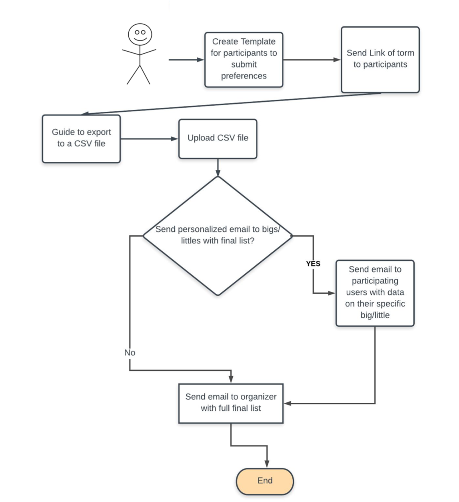
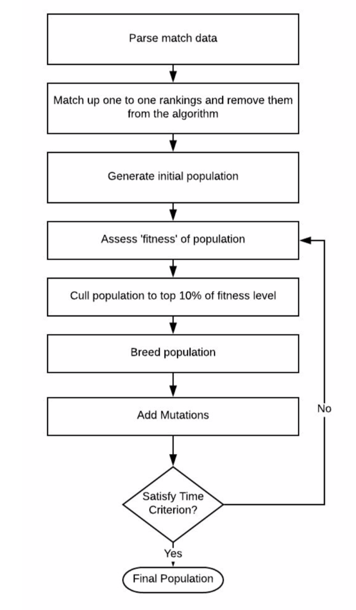

# 6.0 Architectural Design Document

#### Outline of Software Development Plan

6.1 Introduction

6.1.1 System Objectives

6.1.2 Hardware, Software and Human Interfaces

6.2 CSCI Descriptions

6.2.1 Concept of Execution

6.2.2 Interface Design

6.2.2.1 Interface Identification and Diagrams

6.2.2.2 Project Interactions

6.3 Preliminary User Manual

## 6.1 Introduction

This document presents the architecture and detailed design for the software for the Big-Little Project. The project performs matching of bigs and littles in on campus organizations using a genetic algorithm.

### 6.1.1 System Objectives

The system will attempt to address the biases and stress in matching people up in organizations on campus. 

The architecture of the system will be accessible through a web app that can do the hard work for the user. 

### 6.1.2 Hardware, Software and Human Interfaces

| **Interface   Type**   | **Interface**      | **Description**                                              |
| ---------------------- | ------------------ | ------------------------------------------------------------ |
| **Human Interface**    | Mouse and Keyboard | Allows the user to click and type into the web app.          |
| **Human Interface**    | Monitor            | Allows the user to see the web app and interact with it.     |
| **Hardware Interface** | Computer           | Provides ability to run the program                          |
| **Software Interface** | Github IO          | Hosts the actual website and allows users to visit it.       |
| **Front-end**          | Website display    | Program that displays the interactive portion of the site (see mockups below) |

Below are mockups for the user interface:

## 6.2 CSCI Descriptions

The Big-Little system is comprised of a front end which includes an interface that will guide them to create a Google Form. Once they submit the google form to the web app, it uses a parser to create participant objects, and uses the genetic algorithm to get closer to finding a good pair matching.

* **Front End** 
  * Main Page
    * Overview of what the algorithm is, why the user should use it, etc.
    * Guide to create google form
    * Upload Area to upload the exported CSV from the form
    * Choice of emails area
  * Confirmation Page
    * Confirms that the algorithm has started and that the emails will be sent to the users momentarily
* **Genetic Algorithm**
  * Participant
    * Class to store information on each participant and whether they are a big or a little and what their prefrences are.
  * Random matching generator
    * Part of the algorithm that creates a sample of randomly generates matches to create an initial population which varies on the size of the participants
  * Fitness assessment
    * Fitness of match lists based on the ranking of each user to each other user. If one user is not on another user's list, this value defaults to the number of participants. The goal of the fitness assesment is to find the "fittest" matchings or the ones the have the lowest score.
  * Max Heap
    * Stores the best lists so far and their fitness levels.
    * This helps the culling process, because we only store the best matchings, not all of the matchings.
  * Breeding
    * Uses a subsection of one parent and then take the unused people from the other parent in the order that they appear
* **I/O**
  * Google Form creation
    * Button to create a google form with all of the bigs and littles names.
  * Parser for google form output
    * Takes in a CSV document and parses it into participant objects
  * Email program to send out emails to participants

###6.2.1 Concept of Execution

​	Users will probably only interact with the website in one way which is to be guided through the big-little selection process by first creating a Google Form, exporting to a CSV and then uploading it to the web app, and waiting for it to email them the results.	

​	The genetic algorithm itself will follow the structure outlined below:

### 6.2.2 Interface Design

This section will outline the Interface design of Big-Little.

####6.2.2.1 Interface Identification and Diagrams

|         Interface          |          Description          |
| :------------------------: | :---------------------------: |
|      User -> GithubIO      | Initial interaction with site |
|   Main Program -> Parser   |        Parse the Data         |
|  Main Program -> Genetic   |     Find the best matches     |
| Front end -> Main Program  |     Send data to back end     |
| Front end -> Email service |       Email out matches       |

#### 6.2.2.2 Project Interactions

​	The front end project interactions will consist of the front end sending data to the back end. This will happen in the case of calling the Google Form generation script, submitting the csv for parsing as well as send out the final list of matches.

​	The main portion of the program will interact with the front end (as mentioned previously) and will also interact with the parsing and genetic portions of the algorithm.

# 6.3 Final User Manual

The user is defined as an organizer of an organizations big little program.

**Getting Started**

1. Make sure you have a google account. You can set one up here: www.google.com
2. Go to www.biglittle.github.io in any browser.
3. Follow the guide to create a google form with the names of your team members in it. Be careful if you are going to add personalized questions, only add them at the end of the form.
4. Share the link to the form with organization members participating in your big-little process.
5. Allow your members to fill out the form. Once every member has filled out the form, export to form to a CSV and upload it using the 'Upload Now' button on the Big-Little website.

**Get Your Results**

1. Choose who you want to send the results to
   * If you want to just have the results sent to you and no one else click the "Just me" button
   * If you want to have the results sent to you and to the bigs of your organization, click the button that says "Me and the Bigs"
   * If you want to have the results sent to you and everyone in the organization, click the button that says "Everyone"
2. Sit back and wait for an email! It should take no more than 20 minutes to find its way into your inbox!

**FAQs**

* I am getting an input error, why?

​	This means that someone filled out your form wrong! That's okay, just find the identified entry in your Google Forms responses and delete the entry. Then ask the person to fill out the form again (or fill it out yourself) being careful to make sure that you only fill out either the big's sections or the little's sections, depending on your identity in the organization.

* How do I know that I will get a good set of matchings?

​	Our algorithm guarantees that if a specific big and little rank each other as top choice, they will get automatically paired up. As for everyone else, we cycle through lots of different pairings, and find the most overall compatability that we can.

* If there are any major questions and concerns, contact haleyfletch@gmail.com