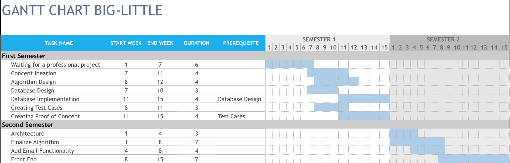

# 4.0 Software Development Plan

## Outline of Software Development Plan

##### 4.1 Plan Introduction

##### 4.1.1 Project Deliverables

##### 4.2 Project Resources

##### 4.2.1 Hardware Resources

##### 4.2.2 Software Resources

##### 4.3 Project Organization

##### 4.4 Project Schedule

##### 4.4.1 GANTT Chart

##### 4.4.2 Task/ Resource Table

### 4.1 Plan Introduction

This Software Development Plan provides the detail of the planned development for the Big-Little Web application which provides an application for users to match mentors and mentees in their organizations.

The Project will use a genetic algorithm to find a good matching of 'bigs' and 'littles' in on campus organizations that submit their prefernces for pairings. This project is designed to help reduce bias on behalf of organizers, as well as to provide a way to decrease the workload of such organizers. In development, the project will accomplish a proof of concept by week 14, as per the course requirements and will be a finished project by end of April 2019.

#### 4.1.1 Project Deliverables

##### Alpha Beta                                      S1 Week 14

Per course requirements, The Big-Little Alpha Beta release will occur on Week 14.

##### PoC                                                     S1 Week 16

Big-Little proof of concept fuctionality will be ready by the end of the first semester. The algorithm will work on a very small test case, but all of the base functionality will be there.

**Architected Class Structure        S2 Week 2**

By week 2 of second semester Big-little will have developed a solid class structure on which to build the functionality of the web app.

**Algorithm Finalized                        S2 Week 8** 

By halfway through second semester, the algorithm for big little will be completely finished and front end development will commence.

**Final Project Delivered                  S2 Week 14**

By end of semester 2, the biglittle project will be finalized and ready to be used by users. It will include a front end.

### 4.2 Project Resources

Resources involved in project development are organized into hardware and software resources. Within those categories, involvement in the development process and/or application execution is indicated.

#### 4.2.1 Hardware Resources

| Resource             | Development | Execution |
| -------------------- | ----------- | --------- |
| Macbook Pro Computer | X           |           |

#### 4.2.1 Software Resources

| Resource         | Application                                                | Development | Execution |
| ---------------- | ---------------------------------------------------------- | ----------- | --------- |
| Atom             | Text editor                                                | X           |           |
| Python           | Programming language                                       | X           | X         |
| JavaScript   | Programming Language        | X           | X         |
| GitHub     | Version Control            | X          |           |
| Google Chrome   | Web browser                  | X           | X |
| Mozilla Firefox | Web browser                  | X           | X         |
| macOs           | Development operating system | X           |           |
| Google Forms    | Data hosting and parsing     | X           | X         |

### 4.3 Project Organization

This section will outline Big-Little project organization, including team member roles and team responsibility.

##### 4.3.1 Organization Structure

We have organized our project members into three teams: data, algorithm and front-end.

| Name           | Team                 | Role                                          |
| -------------- | -------------------- | --------------------------------------------- |
| Haley Fletcher | Algorithm            | Data analysis and matching algorithm creation |
| Haley Fletcher | Google Form Creation | Tool to create Google form                    |
| Haley Fletcher | Front-End            | Front-end designer                            |

##### 4.3.2 Algorithm Team

The Algorithm team is responsible for designing, writing, and testing a genetic algorithm to find a good pairing for members in an organization that they have the rankings to. 

##### 4.3.3 Google Form Team

The Google Form team is responsible for finding the best way to coach users into creating a google form, whether through an autmated script or finsing if the functionality is built into the Google service itself.

##### 4.3.4 Front-End team

The Front-End team is responsible for developing the interfaces between users and the algorithm itself.

##### 4.3.5 Roles and Responsibilities

As this project is a solo project, all of the roles and responsibilities fall on Haley Fletcher. She will not need communication paths because she and the professor are the only people she will be communicating with. She will fill the role of chief programmer as well as the role of front end designer, architect, back end design, and algorithm design.

### 4.4 Project Schedule

This section will detail the Big-Little project schedule including the people and resources necessary for each step.

#### 4.4.1 GANTT Chart

The following GANTT Chart visualizes the duration of the subtasks for Big-Little in relationship with each other.

#### 4.4.2 Task/Resources

| Task                             | People         | Hardware | Software                   |
| -------------------------------- | -------------- | -------- | -------------------------- |
| Creating Test Cases              | Haley Fletcher | Macbook  | Atom, Google Forms         |
| Creating Proof of Concept        | Haley Fletcher | Macbook  | Python, Google Forms, Atom |
| Architectecting class structure  | Haley Fletcher | Macbook  | -                          |
| Web manipulation for Google Form | Haley Fletcher | Macbook  | Python, Selenium, Atom     |
| Front End Development            | Haley Fletcher | Macbook  | Javascript, CSS, HTML      |

