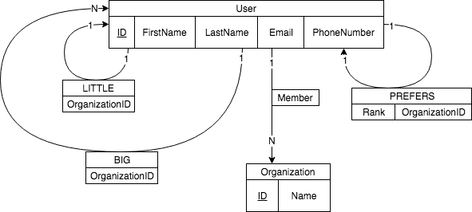

# Preliminary Database Demonstration

### Edward Bachoura, Brian Joerger, Haley Fletcher

##### November 27th, 2018


#### Big Little ERD




##### Example Queries

1. Access the email of a specific user.

   ```
   Match (u:User {ID: 17})
   Return u.Email
   ```


2. Access a specific User's MEMBER relations, given the user's first and last name.

   ```
   Match (User {FirstName: "Waluigi", LastName:"Jones"})-[m:MEMBER]->()
   Return m
   ```

3. Access the User for a given User's most preffered Member in a specific Organization.

   ```
   Match (User {ID: 17})-[:PREFERS {OrganizationID: 0, Rank: 1}]-(u:User)
   Return u
   ```

4. Access all of the matches for a specific organization.

   ```
   Match (:User)-[b:BIG {OrganizationID: 0}]->(:User)
   Return b
   ```

5. Access all of the organizations that a user is involved in.

   ```
   Match (:User {ID: 17})-[:MEMBER]->(o:Organization)
   Return o
   ```
